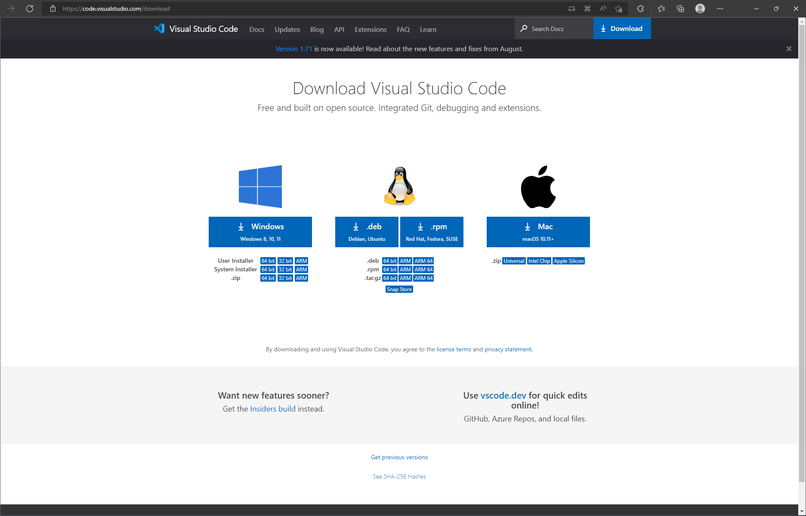
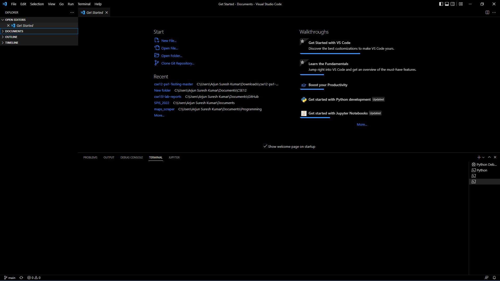
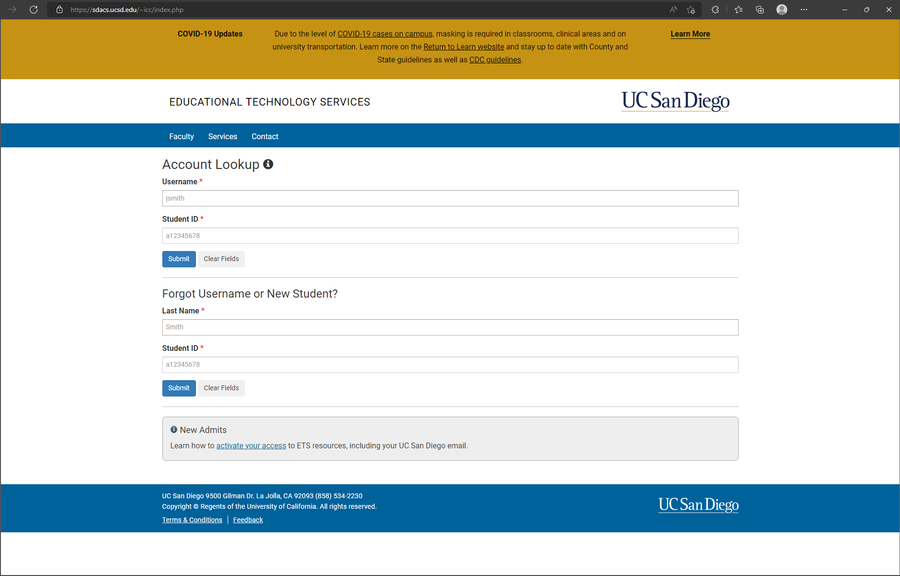
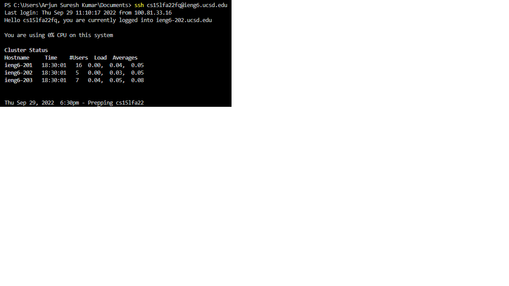
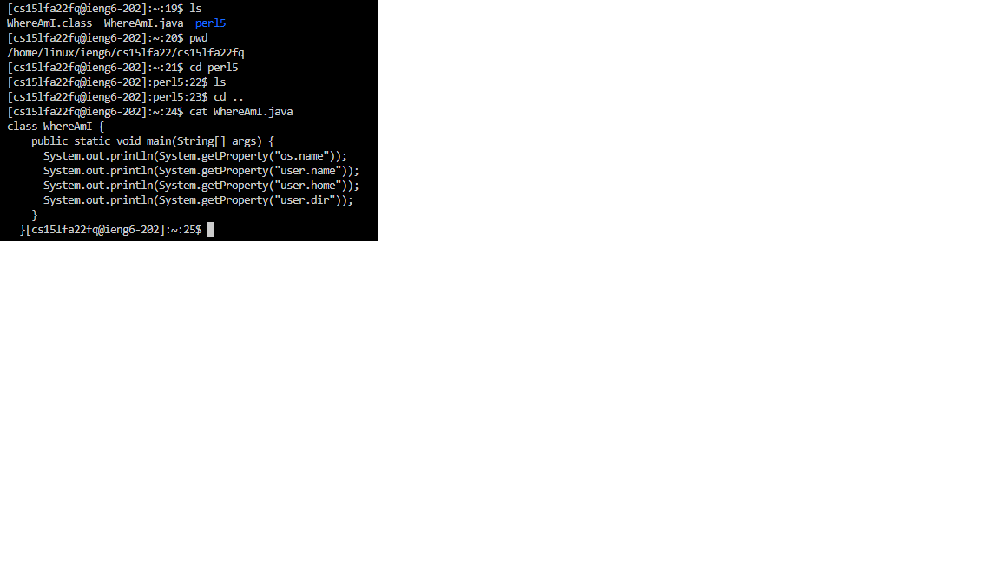

# Remote Tutorial
---
## Installing VSCode

Start by going to [this link](https://code.visualstudio.com/download) and downloading Visual Studio Code.

Follow the installation instructions. Once the installation is complete, you should be looking at an image like this:

*No screenshots of VSCode installation process (completed before lab)*

## Remote Connection

Go to [UCSD password reset](https://sdacs.ucsd.edu/~icc/index.php).

Enter username and ID number to find account.
Click "Reset Password" and follow the instructions thereafter. Make sure that the options to reset passwords for temporary accounts are also selected.

Wait 10-15 minutes for the password change to take effect. In the meantime, go to [this link](https://docs.microsoft.com/en-us/windows-server/administration/openssh/openssh_install_firstuse) and follow the instructions to install OpenSSH. Make sure to install just the client version, not the server version.

Once the password change has taken effect, go to Terminal -> New Terminal in VSCode.

In the new terminal, run `ssh cs15lfa22zz@ieng6.ucsd.edu`, replacing `cs15lfa22zz` with your own specific account name, then enter you password.
Select yes for any trust-related message, and you should now be able to run commands on the UCSD server.

*No screenshots of OpenSSH installation process (completed before lab)*

## Commands

You can now try some commands on the UCSD server, such as mkdir, pwd, cd, ls, etc:

## SCP
## Keys
## Optimization
