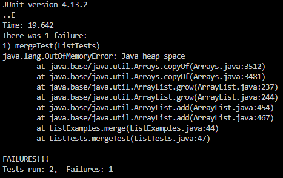

# Lab Report 3

## Week 2 - Servers

### Code for search engine server:
```
import java.io.IOException; //the necessary import statements for the program to function
import java.net.URI;
import java.util.ArrayList;

class Handler implements URLHandler {
    ArrayList<String> searchArray = new ArrayList<String>();

    public String handleRequest(URI url) {
        if (url.getPath().contains("/add")) {
            String[] params = url.getQuery().split("=");
            if (params[0].equals("s")) {
                searchArray.add(params[1]);
                return("String added!");
            }
        }
        if (url.getPath().contains("/search")) {
            String[] params = url.getQuery().split("=");
            if (params[0].equals("s")) {
                ArrayList<String> searchReturn = new ArrayList<>();
                for(String s: searchArray){
                    if(s.contains(params[1])){
                        searchReturn.add(s);
                    }
                }
                return("Strings matching your query: " + searchReturn.toString());
            }
        }
        return("<b>ERROR 404</b>");
    }
}

class SearchEngine {
    public static void main(String[] args) throws IOException{
        if(args.length == 0){
            System.out.println("Missing port number! Try any number between 1024 to 49151");
            return;
        }

        int port = Integer.parseInt(args[0]);

        Server.start(port, new Handler());
    }
}

```
### Screenshots of the functioning server:

---


The URL in the above screenshot calls the handleRequest method, but it does not result in any of the paths being taken. The default path is to display a 404 error (page not found), which is visible in the screenshot.

---


The URL in the above screenshot calls the handleRequest method. This method uses if statements based on the value returned by the URL.getpath() method to direct the program down the /add path. Then, the program extracts the query value by splitting the query around the "=" sign, and adds it to a list. In this example, the value "a" is added.

---


The URL in the above screenshot calls the handleRequest method. This method uses if statements based on the value returned by the URL.getpath() method to direct the program down the /query path. Then, the program extracts the query value by splitting the query around the "=" sign, and iterates through the stored list values to return a list with only the strings that contain the query.

## Week 3 - Bugs

### ReverseInPlace()

Failure inducing input for reverseInPlace():


Symptom:



Fix:

```
static int[] reversed(int[] arr) {
    int[] newArray = new int[arr.length];
    for(int i = 0; i < arr.length; i += 1) {
      newArray[arr.length - i - 1] = arr[i];
    }
    return newArray;
  }
```

Because reverseInPlace() overwrites the initial elements with the elements from the end of the array, when the loop is editing the ending elements, it looks to the overwritten values, making the list a mirror on the midpoint. To fix this, a temp variable can store the value of one side of the midpoint, so it is not overwritten, while the values are switched.