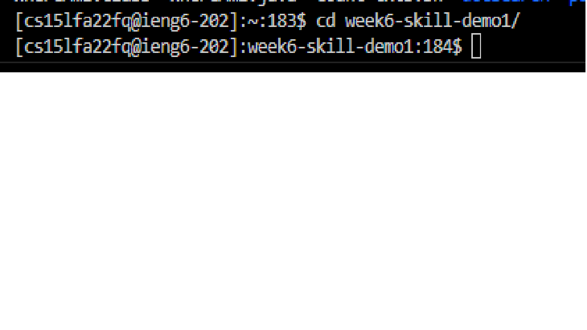
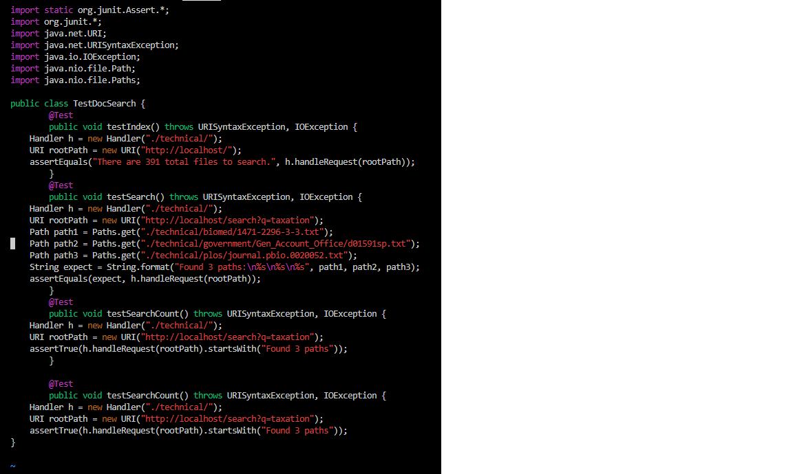
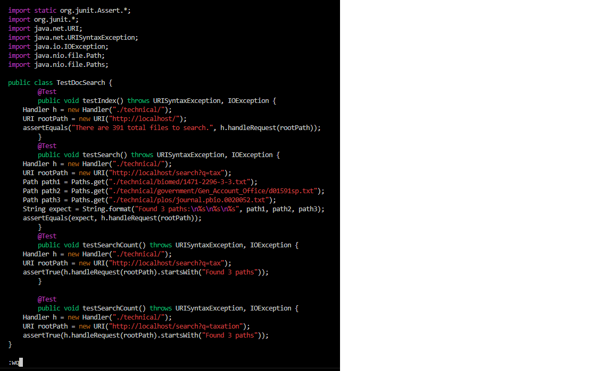

# Lab Report 5 - Vim Commands

Keystrokes necessary to perform the following task:

```
Challenge In TestDocSearch.java, copy the test called testSearchCount, rename the 
new test to testSearchCount2 and change the query string being tested to tax rather 
than taxation.
```

Keystrokes:

```
cd we <TAB> <ENTER>
```


```
vim T <TAB> <ENTER>
```



```
/xa <ENTER>
6xix <ESC>
<ENTER>
```


```
6xix <ESC> :wq
```



## Part 2

Time using scp: 107.61s
Time ssh'ed into the server already, editing in Vim: 55.30s

I would prefer using SCP, because I feel that Vim punishes mistakes far more than a local IDE, meaning the overall time may take longer on average.

The complexity of the directory structure of the project would probably tilt me towards using Vim, because it is far harder to SCP deep into nested directoris consistently.