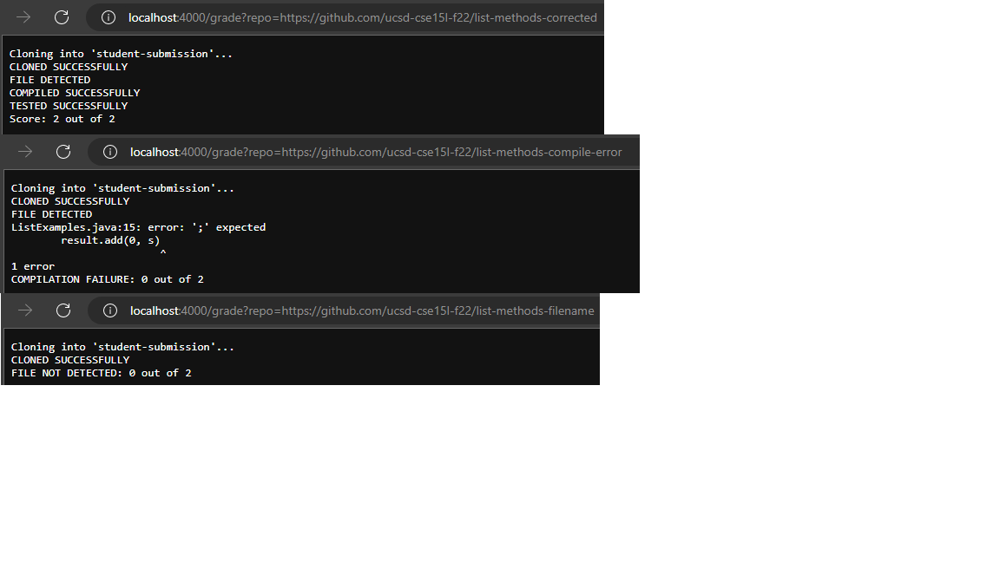

# Week 9 - Autograder

## Grading Script:

```
# Create your grading script here

TESTNUM=2

rm -rf student-submission
git clone $1 student-submission
echo 'CLONED SUCCESSFULLY'

if [ -f student-submission/ListExamples.java ]
then
    echo FILE DETECTED
else
    echo FILE NOT DETECTED: 0 out of $TESTNUM
    exit
fi

cp TestListExamples.java student-submission
cd student-submission

javac -cp ".;../lib/hamcrest-core-1.3.jar;../lib/junit-4.13.2.jar" *.java

if [ $? -eq 0 ]
then
    echo COMPILED SUCCESSFULLY
else
    echo COMPILATION FAILURE: 0 out of $TESTNUM
    exit
fi

OUTPUT=$(java -cp ".;../lib/hamcrest-core-1.3.jar;../lib/junit-4.13.2.jar" org.junit.runner.JUnitCore TestListExamples | sed -n '2,2p;2q')

if [ $? -eq 0 ]
then
    echo TESTED SUCCESSFULLY
else
    echo TEST FAILURE: 0 out of $TESTNUM
    exit
fi

OUTPUT=${#OUTPUT}
ERRORNUM=$((OUTPUT - TESTNUM))
SCORE=$((TESTNUM - ERRORNUM))

echo Score: $SCORE out of $TESTNUM
```

## Examples of Submission Grading



## Trace of Script Execution on Repo "list-methods-filename"

```
TESTNUM=2
```
standard output is empty, standard error is empty, exit code is 0
```
rm -rf student-submission
```
standard output is empty, standard error is empty, exit code is 0
```
git clone $1 student-submission
```
standard output is:
```
Cloning into 
'student-submission'...
remote: Enumerating objects: 4, done.
remote: Counting objects: 100% (4/4), done.
remote: Compressing objects: 100% (2/2), done.
remote: Total 4 (delta 0), reused 4 (delta 0), pack-reused 0
Receiving objects: 100% (4/4), done.'
```
standard error is empty, exit code is 0
```
echo 'CLONED SUCCESSFULLY'
```
standard output is 'CLONED SUCCESSFULLY', standard error is empty, exit code is 0
```
if [ -f student-submission/ListExamples.java ]
```
the condition was false, because there exists no file in the student's submission with the name "ListExamples.java"
```
then
    echo FILE DETECTED
```
does not run
```
else
    echo FILE NOT DETECTED: 0 out of $TESTNUM
```
standard output is 'FILE NOT DETECTED: 0 out of 2', standard error is empty, exit code is 0
```
    exit
```
standard output is empty, standard error is empty, no exit code

***ALL CODE AFTER THIS POINT DOES NOT RUN***
```
fi

cp TestListExamples.java student-submission
cd student-submission

javac -cp ".;../lib/hamcrest-core-1.3.jar;../lib/junit-4.13.2.jar" *.java

if [ $? -eq 0 ]
then
    echo COMPILED SUCCESSFULLY
else
    echo COMPILATION FAILURE: 0 out of $TESTNUM
    exit
fi

OUTPUT=$(java -cp ".;../lib/hamcrest-core-1.3.jar;../lib/junit-4.13.2.jar" org.junit.runner.JUnitCore TestListExamples | sed -n '2,2p;2q')

if [ $? -eq 0 ]
then
    echo TESTED SUCCESSFULLY
else
    echo TEST FAILURE: 0 out of $TESTNUM
    exit
fi

OUTPUT=${#OUTPUT}
ERRORNUM=$((OUTPUT - TESTNUM))
SCORE=$((TESTNUM - ERRORNUM))

echo Score: $SCORE out of $TESTNUM
```